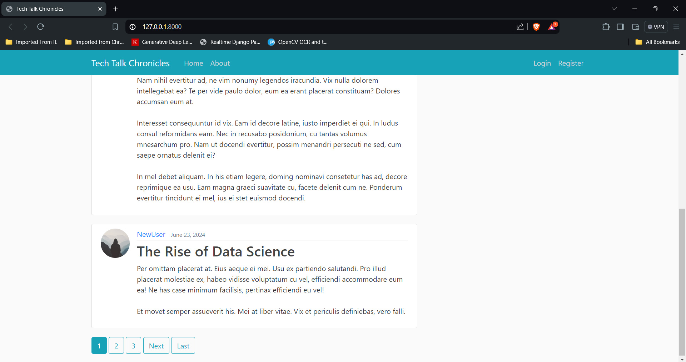
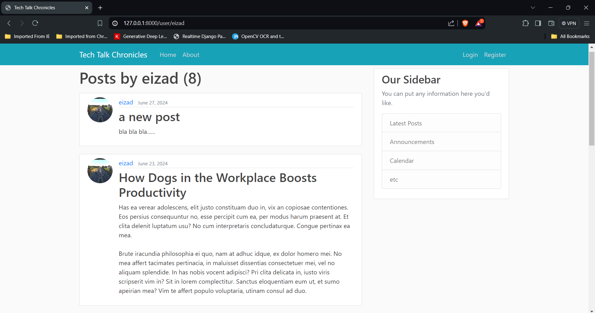
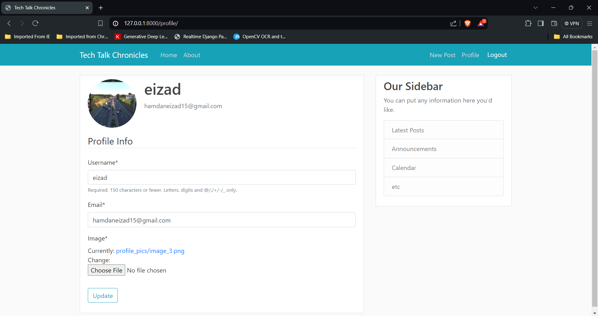
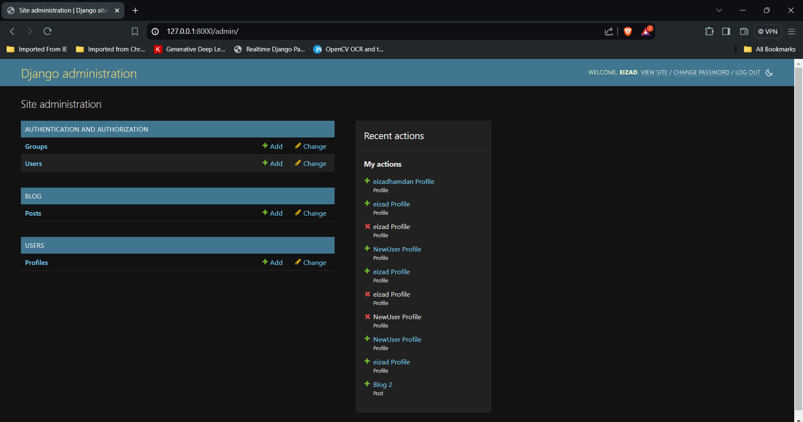

# Blog Website

This is a blog website built using Django for the backend and HTML with Bootstrap CSS for the frontend. The website allows users to create profiles and add their information, such as name, profile picture, and email address. The site administration functionality enables the administrator to manage users and posts.

## Features

- **User Profiles**: Users can create and update their profiles with their name, profile picture, and email address.
- **User Authentication**: Secure login and registration functionality.
- **Post Management**: Users can create, read, update, and delete blog posts.
- **Site Administration**: Administrators can manage users and posts, including creating and deleting users and posts.

## Installation


### Steps

1. **Clone the repository**:
    ```bash
    git clone https://github.com/eizadhamdan/Blog_Website
    cd Blog_Website
    ```


2. **Navigate to the project directory**:
    ```bash
    cd django_project
    ```

3. **Apply the migrations**:
    ```bash
    python manage.py migrate
    ```

4. **Create a superuser for site administration**:
    ```bash
    python manage.py createsuperuser
    ```

5. **Run the development server**:
    ```bash
    python manage.py runserver
    ```

6. **Access the website**:
    Open your web browser and go to `http://127.0.0.1:8000/`.

## Usage

### User Profiles

- Users can register for an account and log in.
- After logging in, users can create and update their profiles by adding their name, profile picture, and email address.

### Post Management

- Logged-in users can create new blog posts, edit their existing posts, and delete posts they own.

### Site Administration

- The site administrator can log in to the Django admin interface at `http://127.0.0.1:8000/admin/`.
- From the admin interface, the administrator can create, update, and delete user accounts.
- The administrator can also manage blog posts, including creating new posts and deleting existing ones.

## Screenshots

### Here are some screenshots of the blog website:
<ul>
   <li>
      <b>Home Page:</b>
      
   </li>

   <li>
      <b>Posts by a user:</b>
      
   </li>

   <li>
      <b>User Profile:</b>
      
   </li>
   
   <li>
      <b>Admin Interface:</b>
      
   </li>
</ul>